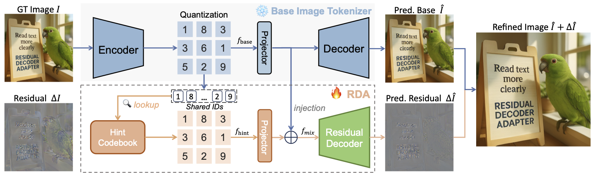
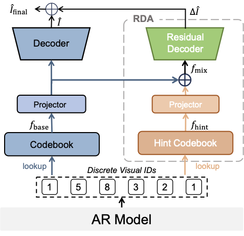
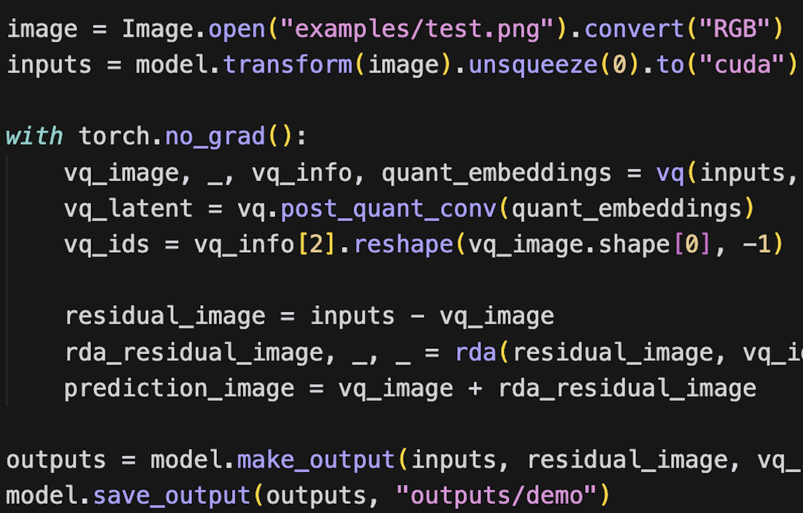
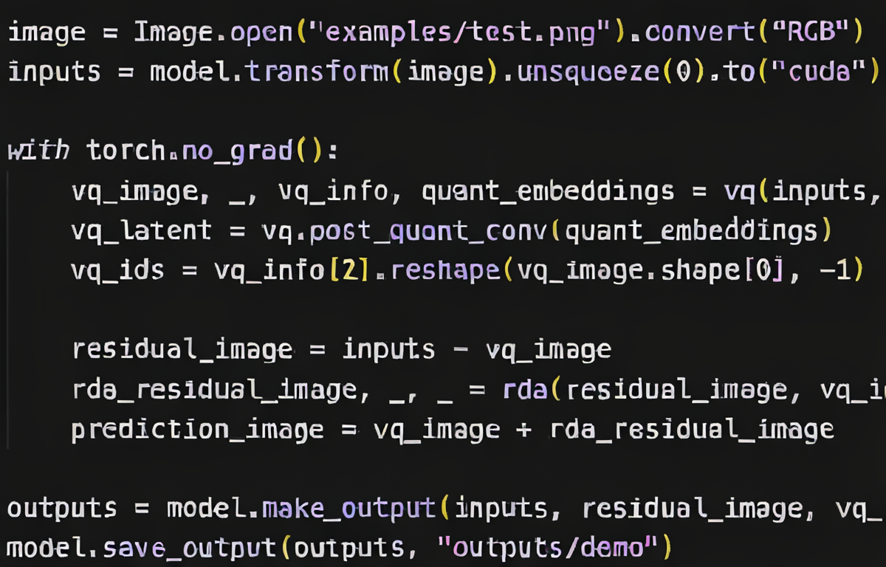
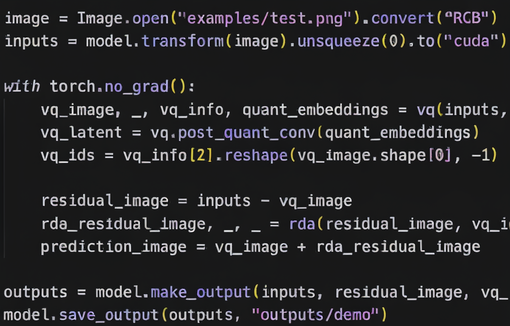
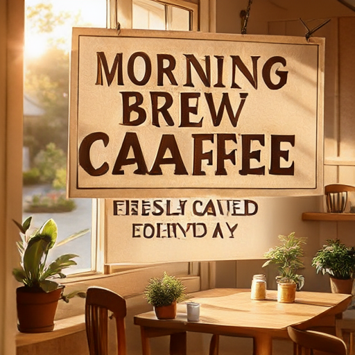
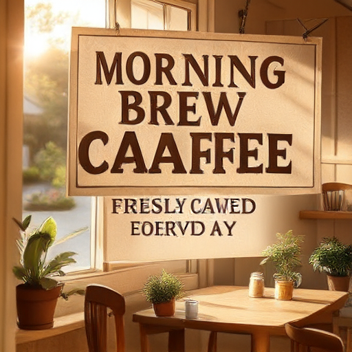

<div align="center">
  <h2 align="center" style="margin-top: 0; margin-bottom: 15px;">
    Residual Decoder Adapter: ID-Preserving Tokenizer Adaption for Autoregressive Text Rendering 
  </h2>
  <p align="center" style="font-size: 15px;">
    <span style="color:#E74C3C; font-weight: bold;">TL;DR:</span> <strong>Improving text rendering performance of AR models without retraining the existing tokenizer and AR model </strong>
  </p>
  <p align="center" style="font-size: 16px;">
    <!-- <a href="https://csu-jpg.github.io/RDA.github.io/" style="text-decoration: none;">🌐 Homepage</a> | -->
    <a href="https://arxiv.org/abs/2606.01911v1" style="text-decoration: none;">📄 Paper</a> | 
    <a href="https://github.com/CSU-JPG/RDA" style="text-decoration: none;"> Code</a> | 
    <a href="" style="text-decoration: none;">📁 Data(coming soon)</a> | 
    <a href="https://huggingface.co/CSU-JPG/RDA_llamagen" style="text-decoration: none;">🤗 Model</a>
  </p>

  </div>

<!-- **[CVPR 2026]** Official code for *Residual Decoder Adapter: ID-Preserving Tokenizer Adaption for Autoregressive Text Rendering*. -->


## Overview


<p align="center">
  
  

</p>
<p>
  <strong>RDA training and inference pipeline.</strong>
  Left: RDA is trained with a frozen pretrained VQ tokenizer to model the residual
between the input image and the base reconstruction. Right: during inference or AR
generation, the tokenizer IDs and AR model remain unchanged; RDA only adapts the
decoding stage by adding a learned residual to the base VQ output.
</p>

<!-- <p align="center">
  <strong>Overview of the proposed Residual Decoder Adapter (RDA).</strong>
  RDA enhances an existing image tokenizer without modifying its token space or retraining. RDA predict an residual image, which is added into original image to obtain the refined output.
</p> -->


<!-- 
<p align="center">
  
</p>
<p align="center">
  <strong>Inference pipeline of the AR model with equipped RDA.</strong>
   RDA uses the same IDs to refine the generated image.
</p> -->


## News


- **2026-06**: Code for training and inference are released.

## Setup

Create the environment:

```bash
conda create -n rda python=3.10 -y
conda activate rda
pip install torch==2.5.0 torchvision==0.20.0 torchaudio==2.5.0 --index-url https://download.pytorch.org/whl/cu121
pip install -r requirements.txt
```

Tokenizer training and inference require a pretrained base VQVAE tokenizer, here we use LlamaGenVQ `vq_ds16_t2i.pt`.

Download the LlamaGenVQ checkpoint:

```bash
mkdir -p pretrained_model
wget -O pretrained_model/vq_ds16_t2i.pt https://huggingface.co/peizesun/llamagen_t2i/resolve/main/vq_ds16_t2i.pt
```

## Quick Run

### RDA tokenizer reconstruction

```python
import torch
from PIL import Image

from tokenizer.tokenizer_image.rda_model import RDATokenizer


model = RDATokenizer.from_pretrained(
    "CSU-JPG/RDA_llamagen",
    vq_ckpt="pretrained_model/vq_ds16_t2i.pt",
).to("cuda")

vq = model.vq_model
rda = model.resvq_model

image = Image.open("examples/test.png").convert("RGB")
inputs = model.transform(image).unsqueeze(0).to("cuda")

with torch.no_grad():
    vq_image, _, vq_info, quant_embeddings = vq(inputs, return_quant=True)
    vq_latent = vq.post_quant_conv(quant_embeddings)
    vq_ids = vq_info[2].reshape(vq_image.shape[0], -1)

    residual_image = inputs - vq_image
    rda_residual_image, _, _ = rda(residual_image, vq_ids, vq_latent)
    prediction_image = vq_image + rda_residual_image

outputs = model.make_output(inputs, residual_image, vq_image, rda_residual_image, prediction_image)
model.save_output(outputs, "outputs/demo")
```


<p align="center">
  
  
  
</p>
<p align="center">
  <strong>RDA tokenizer demo.</strong> Left: input image. Middle: base VQ reconstruction. Right: final reconstruction with RDA.
</p>

You also can see the output folder `outputs/demo/` for more details. 

### Tar text-to-image generation with RDA

This demo uses Tar as the autoregressive image-token generator and RDA as the residual decoder adapter. Before running it, install the extra Tar dependencies following the original [Tar setup instructions](https://github.com/csuhan/Tar).

```python
import torch

from inference_ar_model.Tar.t2i_inference_rda_prompt import (
    TarRDAInference,
    T2IConfig,
    RDAConfig,
    resolve_file,
    resolve_rda_model,
)

torch.manual_seed(0)

prompt = "A cozy and bright coffee shop signboard with the text 'Morning Brew Cafe - Freshly Roasted Everyday'. Soft beige and light brown colors, sunlight streaming through the window, relaxed vibe."

ar_path = resolve_file(None, "ar_dtok_lp_512px.pth", "csuhan/TA-Tok")
encoder_path = resolve_file(None, "ta_tok.pth", "csuhan/TA-Tok")
vq_ckpt = "pretrained_model/vq_ds16_t2i.pt"
rda_ckpt, rda_config = resolve_rda_model("CSU-JPG/RDA_llamagen")

model = TarRDAInference(
    T2IConfig(
        model_path="csuhan/Tar-7B",
        ar_path=str(ar_path),
        encoder_path=str(encoder_path),
        decoder_path=str(vq_ckpt),
    ),
    RDAConfig(
        checkpoint_path=rda_ckpt,
    ),
)

with torch.no_grad():
    ar_codes = model.generate_ar_codes(prompt)

    vq_image, vq_ids, quant_embeddings = model.decode_vq_image(ar_codes)
    rda_residual_image = model.decode_rda_residual(vq_ids, quant_embeddings)
    prediction_image = vq_image + rda_residual_image

outputs = model.make_output(vq_image, rda_residual_image, prediction_image)
output_dir = "outputs/tar_rda_demo"
model.save_output(outputs, output_dir, prompt)
```

<p align="center">
  
  
</p>
<p align="center">
  <strong>Tar + RDA generation demo.</strong> Left: direct VQ-decoded AR generation. Right: RDA-refined final prediction.
</p>

## Data Format

Tokenizer training and inference use `json_data`. The input file can be a JSON list of image paths:

```json
[
  "path/to/image_1",
  "path/to/image_2"
]
```

or a JSON list of objects with an `image` field:

```json
[
  {"image": "path/to/image_1"},
  {"image": "path/to/image_2"}
]
```

A small example is provided at:

```text
examples/inference/sample_images.json
```

The full training and inference data release is in preparation. For now, `examples/inference/sample_images.json` is provided as a minimal example for running the tokenizer inference and training launchers. You can also create your own JSON file following the same format.

## Inference

### Tokenizer Inference

The tokenizer inference code reconstructs images with a base VQ checkpoint plus an RDA checkpoint. `RDA_MODEL` can be a Hugging Face repo id, a local `.pt` checkpoint path, or a local Hugging Face-style model directory.


```bash
DATA_PATH=examples/inference/sample_images.json \
OUTPUT_DIR=outputs/rda_inference \
VQ_CKPT=/path/to/vq_ds16_t2i.pt \
RDA_MODEL=CSU-JPG/RDA_llamagen \
GLOBAL_BATCH_SIZE=2 \
NUM_WORKERS=1 \
bash scripts/tokenizer/infer_tokenizer.sh
```

`RDA_MODEL` can also be a local checkpoint path, e.g. `/path/to/your_own.pt`.


The output directory contains:

- `gt/`: preprocessed input images
- `residual/`: input minus base VQ reconstruction
- `vq/`: base VQ reconstruction
- `resvq/`: RDA residual reconstruction
- `prediction/`: final reconstruction
- `comparison/`: side-by-side comparison

### AR Model Inference

A minimal Tar + RDA prompt inference demo is provided at:

```text
inference_ar_model/Tar/t2i_inference_rda_prompt.py
```

Other AR-model inference code under `inference_ar_model/` is included for reference and will be organized in later updates.

## Training


```bash
DATA_PATH=/path/to/train_images.json \
OUTPUT_DIR=outputs/rda_train \
VQ_CKPT=/path/to/vq_ds16_t2i.pt \
NPROC_PER_NODE=4 \
GLOBAL_BATCH_SIZE=32 \
NUM_WORKERS=16 \
bash scripts/tokenizer/train_tokenizer.sh
```

## Evaluation

The evaluation workflow has not been fully organized for this release yet. We will clean and document it in a later update.


## BibTeX

```bibtex
@misc{mao2026residualdecoderadapteridpreserving,
      title={Residual Decoder Adapter: ID-Preserving Tokenizer Adaption for Autoregressive Text Rendering}, 
      author={Dongxing Mao and Jinpeng Wang and Jiahao Tang and Kevin Qinghong Lin and Linjie Li and Zhengyuan Yang and Lijuan Wang and Min Li and Jingru Tan},
      year={2026},
      eprint={2606.01911},
      archivePrefix={arXiv},
      primaryClass={cs.CV},
      url={https://arxiv.org/abs/2606.01911}, 
}
```

## Contact

For questions, please open an issue or contact us at m962479949@gmail.com.

## License

This project is released under the MIT License. See [LICENSE](LICENSE) for details.
